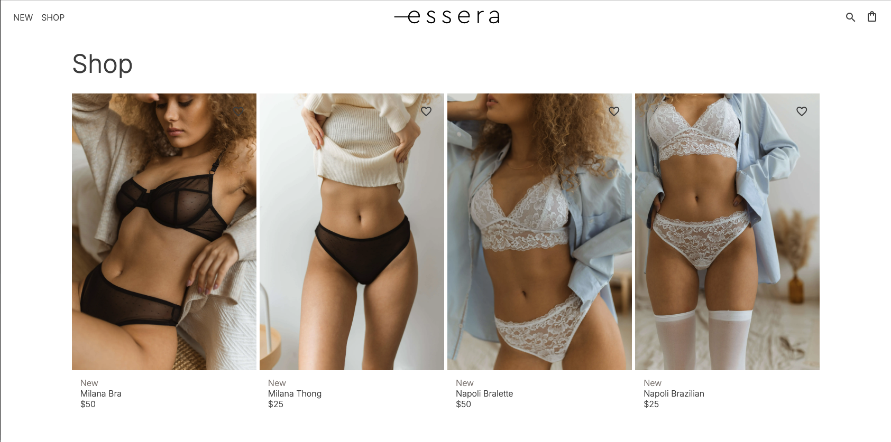
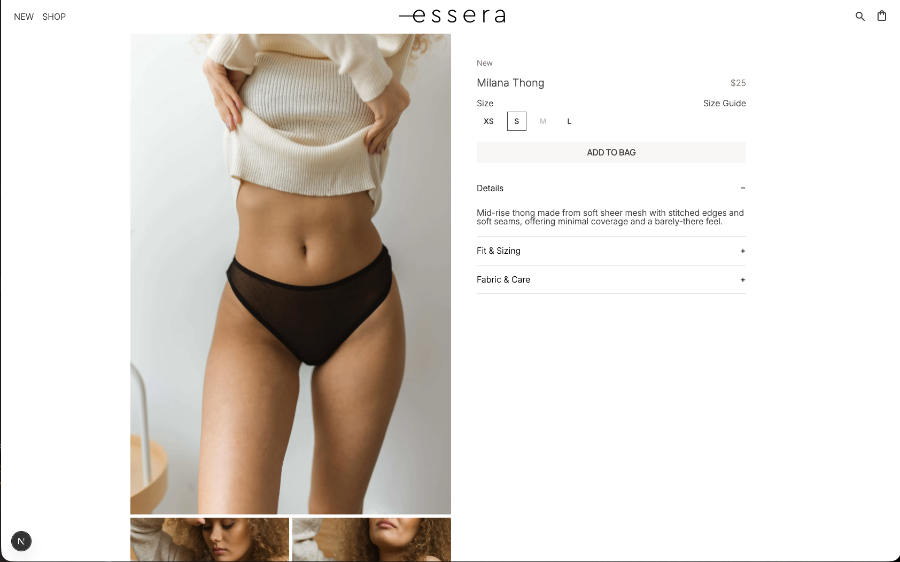
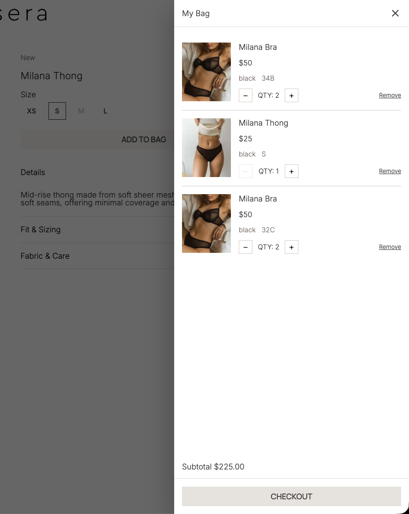
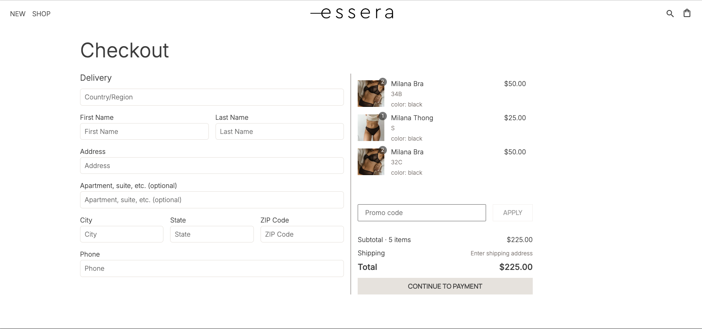

# Essera Frontend

Frontend application for **Essera**, an early-stage retail platform built as a personal product project.

The focus of this repository is frontend architecture, server-side rendering, and building scalable UI using modern Next.js features.

---

## 🚀 Project Status

**Work in progress.**  
Core architecture and data flows are implemented.  
Some UI flows and forms are still evolving.

---

## 🧠 Overview

This frontend is designed to closely resemble a real-world product codebase rather than a demo project.

Key goals:
- Scalable frontend architecture
- Clear separation of concerns
- Server-driven data fetching
- Maintainable styling without heavy UI frameworks

---

## 🛠 Tech Stack

- **Next.js** (App Router, Server Components)
- **TypeScript**
- **CSS Modules** (custom styling)
- **Zustand** for state management
- **Supabase Auth**
- Native `fetch` for server-side data fetching

---

## 📸 Screenshots

Some key screens from the current implementation:






_Screenshots are taken from the local development environment and represent the current state of the project._

---

## 🧩 Frontend Architecture

- Uses **Next.js App Router** with Server Components
- Clear separation between:
	- UI components
	- Hooks
	- State stores
	- Domain logic
- CSS Modules are used for predictable, encapsulated styling
- Zustand helps avoid prop drilling and keeps state logic explicit and isolated

---

## 🔐 Authentication

- Authentication handled via **Supabase Auth**
- User session is resolved on the server and used for protected flows
- Frontend communicates with a protected REST API

---

## 📡 API Integration

- REST API integration with the backend service
- DTO-based responses ensure predictable data contracts
- Server-side data fetching used where possible

---

## 🧭 Future Improvements

The next development phase is focused on completing the checkout experience and preparing the product for real-world usage:

- **Address autocomplete and validation**  
  Integrate Google Maps Places API to provide address suggestions and reduce input errors during checkout.

- **Payment integration**  
  Implement a payment flow using a third-party provider (Stripe) to support secure online payments with per-transaction fees.

- **Checkout flow polish**  
  Improve form UX, validation, and error handling to create a smoother checkout experience.

- **UI and accessibility improvements**  
  Refine visual details and improve accessibility across key user flows.

---

## ⚙️ Local Development

Install dependencies and start the development server:

```bash
npm install
npm run dev
```

The application will be available at:
http://localhost:3000

---
## 👩‍💻 Author

Built by **Tatiana Anosova**  
Senior/Staff Frontend Engineer

- LinkedIn: https://www.linkedin.com/in/tatiana-anosova
- Email: tatiana.anosova78@gmail.com
